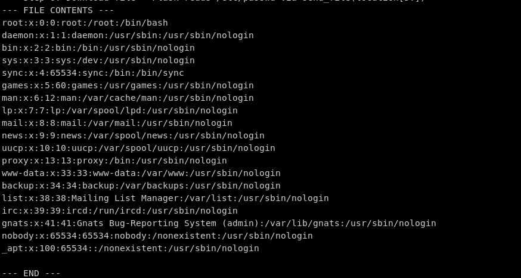
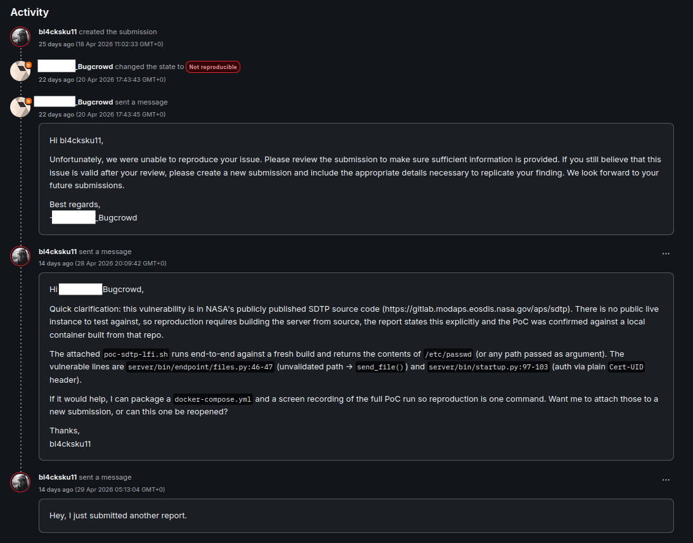
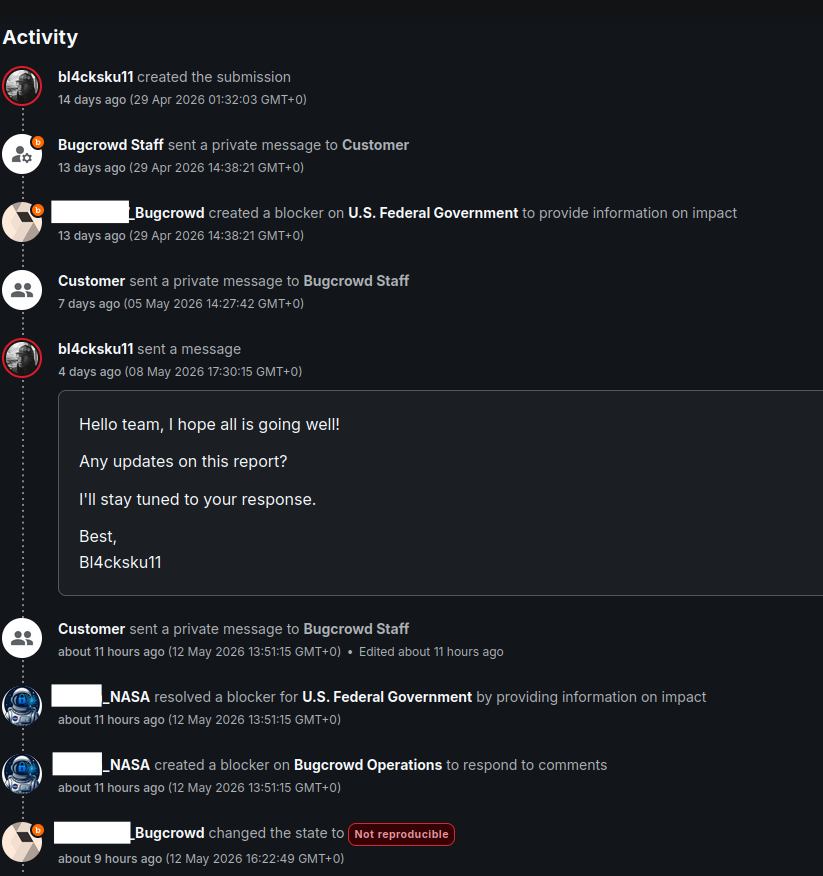

# Unauthenticated Arbitrary File Read in NASA's SDTP Server

**Date:** 2026-05-13 **Program:** NASA VDP (Bugcrowd) **Severity:** P2 / High **Status:** Closed as "False Positive." Disclosure requested. **CWEs:** CWE-22 (Path Traversal), CWE-306 (Missing Authentication for Critical Function)

---

I found an auth bypass and path traversal chain in NASA's Science Data Transfer Protocol (SDTP) server that lets an unauthenticated attacker read database credentials, Kubernetes service account tokens, and application config from the server's filesystem. I submitted it to NASA's Vulnerability Disclosure Program on Bugcrowd. They closed it twice, calling it a false positive.

This is the full story.

---

## What is SDTP?
NASA's Science Data Transfer Protocol (SDTP) is a file distribution service inside the APS (Algorithm Publishing System) ecosystem. Science data providers publish files, subscribers retrieve them through a REST API built on Flask. The backend is PostgreSQL and the whole thing is designed to run on Kubernetes.

The full source code is publicly available on NASA's GitLab: https://gitlab.modaps.eosdis.nasa.gov/infrastructure/transfers/sdtp

The project ships with Kubernetes deployment manifests under `deploy/kubernetes/`, Docker configs, database schemas, everything. It's all there.

---

## The Vulnerabilities
Two vulnerabilities chain together into unauthenticated arbitrary file read.

### 1. Authentication Bypass via Unsigned Header (CWE-306)
SDTP authenticates every single request by reading a plain HTTP header called `Cert-UID`. That's it. No certificate validation, no signature, no session token, no HMAC, nothing. If you can set an HTTP header, you can authenticate as anyone.

Here's the actual code from `server/bin/startup.py`, lines 97-103:

```python
@apiV1.before_request
def getUsername():
    if request.headers.get('Cert-UID'):
        g.username = request.headers.get('Cert-UID')    # Trusted without verification
        # role lookup from DB follows...
    else:
        return Response('', status=401)
```

Let me break this down. This is a Flask `before_request` hook, which means it runs before every single API call. The function checks if the incoming HTTP request has a `Cert-UID` header. If it does, it takes the value and sets it as the authenticated username. No questions asked. No verification. If the header says `Cert-UID: admin`, then congratulations, you're admin.

The assumption here is that a reverse proxy (Apache, Nginx, etc.) sitting in front of SDTP will strip this header from external requests and only set it after validating a real client certificate. But that's never enforced or even documented as a security requirement anywhere in the source code. The application just trusts whatever value comes in.

And it gets worse. Admins can impersonate any other user with a second header:

```python
# server/bin/startup.py:108-113
if g.role == 'admin' and request.headers.get('SDTP-Impersonate-User'):
    g.username = request.headers.get('SDTP-Impersonate-User')
```

So once you're admin (which costs one HTTP header), you can pivot to act as any subscriber and access all their files.

### 2. Path Traversal via file: Location Prefix (CWE-22)
SDTP stores file metadata in PostgreSQL, including a `location` field that tells the server where the actual file lives. When a stored file has a `file:` location prefix, the download endpoint strips the prefix and passes the rest directly to Flask's `send_file()`.

Here's the vulnerable code from `server/bin/endpoint/files.py`, lines 46-47:

```python
elif str.startswith(location, 'file:'):
    resp = send_file(location[5:])    # User-controlled path, no validation
```

This is the entire file-serving logic for local files. `location[5:]` strips the `file:` prefix (5 characters) and whatever remains gets passed straight into `send_file()`. There is no `os.path.realpath()`, no check against a base directory, no allowlist, no blocklist, no nothing. If you store a file record with `location: file:/etc/postgresql-common/pg_service.conf`, Flask will happily open that path and stream the contents back to you.

Flask's `send_file()` is designed to serve files from the filesystem. It calls `os.stat()` to get the file size, sets the content headers, and streams the bytes. It's doing exactly what it's supposed to do. The problem is that the application is giving it an attacker-controlled path with zero sanitization.

---

## The Attack Chain
Chaining both vulnerabilities together, an unauthenticated attacker can read any regular file from the SDTP server's filesystem through the application's own API. Here's the full flow:

1. **Register as admin.** Send `PUT /register` with `Cert-UID: attacker`. On an empty database, the first user automatically gets the admin role. Even on a populated database, the `Cert-UID` bypass lets you authenticate as any existing user.
    
2. **Create a subscription.** SDTP uses a tag-based subscription model to distribute files. You need a subscription with matching tags so that when you store a file, the system creates a `subfiles` entry linking it to your account. Without this, the file exists in the database but you can't see it or download it.
    
3. **Store a malicious file record.** Send `PUT /files` with a JSON payload containing `"location": "file:/etc/postgresql-common/pg_service.conf"` and tags matching your subscription.
    
4. **List files.** Send `GET /files` to get the file ID assigned by the database.
    
5. **Download.** Send `GET /files/{id}`. Flask calls `send_file("/etc/postgresql-common/pg_service.conf")` and streams back the actual file contents. You now have the PostgreSQL hostname, username, database name, and plaintext password.
    
6. **Repeat** for any other file: K8s service account token, app config, whatever.


### What Can You Read?

|File|What's In It|Why It Matters|
|---|---|---|
|`/etc/postgresql-common/pg_service.conf`|DB host, user, dbname, **plaintext password**|Full read/write access to the SDTP database|
|`/var/run/secrets/kubernetes.io/serviceaccount/token`|Kubernetes service account JWT|Authenticated API calls against the K8s cluster. Pod creation, secret listing, lateral movement depending on RBAC bindings|
|`/app/conf/sdtp.yaml`|Application configuration|Expiration settings, upload limits, debug mode|
|`/etc/passwd`|System users|Recon, proof of file read|

One limitation worth noting: `/proc/` virtual filesystem paths are NOT readable through this vector. Flask's `send_file()` calls `os.stat()` to determine file size before streaming, and procfs reports all sizes as 0, so the response comes back empty. This only affects virtual filesystems. Regular files work fine.

---

## The PoC
There is no public SDTP instance exposed for testing. The upstream Dockerfile pulls from NASA's private container registry (`registry.modaps.eosdis.nasa.gov`), which external users can't access. So I built a Docker reproduction environment from NASA's own source code.

The PoC repo adds only deployment scaffolding on top of NASA's unmodified source: a Dockerfile using a public Ubuntu base image, a docker-compose.yml, an entrypoint script, and a PostgreSQL init script. Zero modifications to any SDTP source file. You can verify this with one command:

```bash
git diff 6d905b9 HEAD -- ':!POC.md' ':!docker-compose.yml' ':!poc/'
# Returns empty output. Zero source changes.
```

### Deploying the vulnerable server (< 2 minutes)
```bash
git clone https://github.com/bl4cksku11/sdtp-bugcrowd-poc.git
cd sdtp-bugcrowd-poc
docker compose up --build
# SDTP is now running at http://localhost:18080
```

### Running the exploit
```bash
chmod +x poc-sdtp-lfi.sh
./poc-sdtp-lfi.sh                    # reads /etc/passwd
./poc-sdtp-lfi.sh /app/conf/sdtp.yaml
./poc-sdtp-lfi.sh /etc/postgresql-common/pg_service.conf
./poc-sdtp-lfi.sh /var/run/secrets/kubernetes.io/serviceaccount/token
```

The script automates all six steps: register, get UID, create subscription, store malicious file, list files, download. Full chain, end to end.

### PoC Video


### Screenshots
**Confirmed read of /etc/passwd:**



---

## The Disclosure Timeline
I submitted this to NASA's Vulnerability Disclosure Program on Bugcrowd. It was closed twice.

### Report #1



### Report #2



---

## NASA's Response
This was NASA's reason for closing the report the second time:

> "The researcher is retrieving data from their local infrastructure. They are not able to obtain data from our server because they do not have privileges to our SDTP server. Further, even if they managed to obtain elevated privileges the files they would have access to are in a sandboxed environment. The files are public, including the /etc/passwd file, and can be obtained by any user simply by downloading a vanilla ubuntu docker image and examining any file in that container including the /etc/passwd file."

Let me address each claim.

### "Retrieving data from their local infrastructure"
Yes. This is a VDP. I am not going to send `Cert-UID: admin` to NASA's production server and read their database credentials without authorization. That would be unauthorized access. Instead, I cloned the source code that NASA publishes, built it exactly as documented, and demonstrated that the application code contains an arbitrary file read vulnerability. The vulnerability exists in the source code NASA ships and deploys. Testing locally is how responsible disclosure works.

### "Do not have privileges to our SDTP server"
That IS the vulnerability. No privileges are needed. `Cert-UID` is a plain unsigned HTTP header. Any HTTP client that can reach the endpoint can set `Cert-UID: admin` and authenticate as admin. There is no certificate validation, no session token, no signature. If the reverse proxy doesn't strip the header (which is not enforced or documented anywhere in the source), the application trusts it blindly.

### "Sandboxed environment" / "Files are public, including /etc/passwd"
The report does not claim `/etc/passwd` is sensitive. It was used as proof of concept to confirm the file read works. The actual impact targets are files **inside** the container that contain secrets:

- `/etc/postgresql-common/pg_service.conf` returns the PostgreSQL hostname, username, database name, and **plaintext password**.
- `/var/run/secrets/kubernetes.io/serviceaccount/token` is a Kubernetes service account JWT that is automatically mounted into every pod by the kubelet. SDTP's own repo includes K8s manifests under `deploy/kubernetes/`.
- `/app/conf/sdtp.yaml` returns the full application configuration.

These are not "public files from a vanilla Ubuntu image." They are application secrets and infrastructure credentials that exist inside the running container because the application needs them to function.

**"Sandboxed" does not mean "no sensitive data inside."** Container isolation protects the host from the container. It does not protect secrets inside the container from an application-level file read vulnerability.

---

## Let's Talk About Bugcrowd Triage
This is not the first time I've seen this happen on Bugcrowd, and it won't be the last. Reports getting marked as "Not Reproducible" or "Duplicate" without the triager actually understanding the finding is a pattern that every bug bounty researcher knows too well. It happens across programs and across platforms, but on Bugcrowd specifically, this kind of dismissal is something researchers deal with constantly.

And here's the thing that makes this particular case even more ridiculous: this is a VDP. NASA's Vulnerability Disclosure Program doesn't pay bounties. The reward is a letter. A thank you letter. That's it. There is no financial incentive on the researcher's side to submit garbage reports. I spent days building the Docker environment, writing the exploit script, recording the video, and writing a detailed report with exact source code references. All for a letter.

And they still couldn't be bothered to run `docker compose up --build` and `./poc-sdtp-lfi.sh` to verify a six-step exploit chain that takes less than two minutes.

When programs close valid reports without engaging with the technical content, it doesn't just waste the researcher's time. It means real vulnerabilities stay unfixed. The `file:` path traversal and the `Cert-UID` header bypass are still in NASA's source code right now. Anyone who clones that repo and deploys it without knowing they need to strip authentication headers at the proxy is running a server that gives unauthenticated users access to every file on the filesystem.

I've requested public disclosure through Bugcrowd's CrowdStream. The source code, the PoC environment, and the exploit script are all publicly available for anyone to verify independently.

---

## Remediation
For anyone deploying SDTP or maintaining the codebase:

1. **Remove `file:` prefix support** from the download endpoint. Use `nginx:` (X-Accel-Redirect) or `apache:` (X-Sendfile) to delegate file serving to the web server instead of Flask's `send_file()`.
    
2. **If `file:` must stay**, validate the resolved path against an allowed base directory:
    

```python
import os
SAFE_BASE = '/home/aps/data/'
abs_path = os.path.realpath(location[5:])
if not abs_path.startswith(SAFE_BASE):
    abort(403)
resp = send_file(abs_path)
```

3. **Strip `Cert-UID` and `SDTP-Impersonate-User` headers** at the reverse proxy before forwarding requests to SDTP. Document this as an explicit, mandatory deployment requirement.

---

## Links
- SDTP source code: https://gitlab.modaps.eosdis.nasa.gov/infrastructure/transfers/sdtp
- PoC repo (deployment scaffolding only, zero source changes): https://github.com/bl4cksku11/sdtp-bugcrowd-poc
- CWE-22: Improper Limitation of a Pathname to a Restricted Directory
- CWE-306: Missing Authentication for Critical Function
- OWASP Top 10 2021, A01: Broken Access Control
