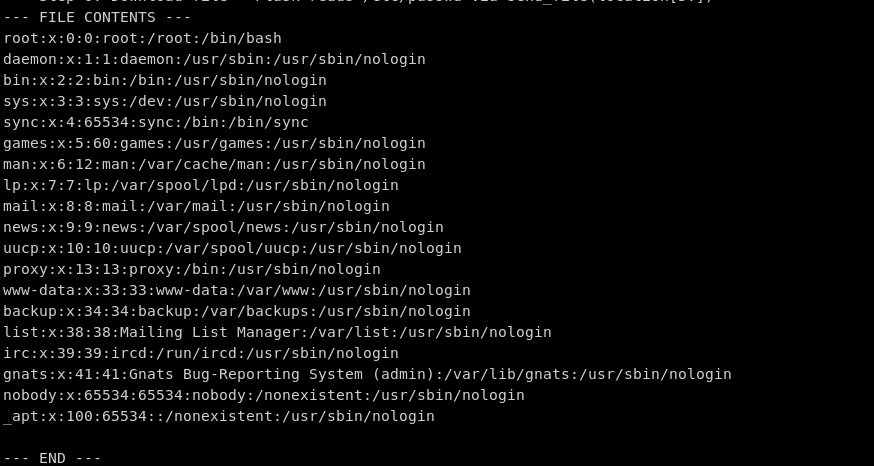

# Lectura arbitraria de archivos sin autenticación en el servidor SDTP de NASA

**Fecha:** 2026-05-12 **Programa:** NASA VDP (Bugcrowd) **Severidad:** P2 / Alta **Estado:** Resuelto. Parcheado en el commit `3c2fa8c`. Carta de reconocimiento del VDP emitida. **CWEs:** CWE-22 (Path Traversal), CWE-306 (Missing Authentication for Critical Function)

---

Un chain de auth bypass y path traversal en el servidor Science Data Transfer Protocol (SDTP) de NASA permite a un atacante sin autenticación leer credenciales de base de datos, tokens de service account de Kubernetes y configuración de la aplicación desde el sistema de archivos del servidor, todo a través de la propia API REST de la aplicación.

---

## ¿Qué es SDTP?
El Science Data Transfer Protocol (SDTP) de NASA es un servicio de distribución de archivos dentro del ecosistema APS (Algorithm Publishing System). Los proveedores de datos científicos publican archivos y los suscriptores los recuperan a través de una API REST construida sobre Flask. El backend es PostgreSQL y todo el sistema está diseñado para correr sobre Kubernetes.

El código fuente completo está disponible públicamente en el GitLab de NASA: https://gitlab.modaps.eosdis.nasa.gov/infrastructure/transfers/sdtp

El proyecto incluye manifests de deployment de Kubernetes bajo `deploy/kubernetes/`, configuración de Docker, esquemas de base de datos, todo. Está todo ahí.

---

## Las vulnerabilidades
Dos vulnerabilidades se encadenan para producir lectura arbitraria de archivos sin autenticación.

### 1. Bypass de autenticación mediante header sin firma (CWE-306)
SDTP autentica cada request leyendo un header HTTP plano llamado `Cert-UID`. Eso es todo. Sin validación de certificado, sin firma, sin token de sesión, sin HMAC, nada. Si puedes setear un header HTTP, puedes autenticarte como cualquiera.

Este es el código real de `server/bin/startup.py`, líneas 97-103:

```python
@apiV1.before_request
def getUsername():
    if request.headers.get('Cert-UID'):
        g.username = request.headers.get('Cert-UID')    # Confiado sin verificación
        # sigue el lookup del rol desde la DB...
    else:
        return Response('', status=401)
```

Te lo desgloso. Este es un hook `before_request` de Flask, lo que significa que se ejecuta antes de cada llamada a la API. La función chequea si el request entrante tiene un header HTTP `Cert-UID`. Si lo tiene, agarra el valor y lo establece como el username autenticado. Sin preguntas. Sin verificación. Si el header dice `Cert-UID: admin`, felicitaciones, eres admin.

La suposición acá es que un reverse proxy (Apache, Nginx, etc.) parado delante de SDTP va a stripear ese header de los requests externos y solo lo va a setear después de validar un certificado de cliente real. Pero eso nunca se enforza, ni siquiera está documentado como un requerimiento de seguridad en ninguna parte del código fuente. La aplicación simplemente confía en cualquier valor que entre.

Y se pone peor. Los admins pueden impersonar a cualquier otro usuario con un segundo header:

```python
# server/bin/startup.py:108-113
if g.role == 'admin' and request.headers.get('SDTP-Impersonate-User'):
    g.username = request.headers.get('SDTP-Impersonate-User')
```

Entonces, una vez que eres admin (lo cual cuesta un header HTTP), puedes pivotar para actuar como cualquier suscriptor y acceder a todos sus archivos.

### 2. Path traversal mediante prefijo de location file: (CWE-22)
SDTP almacena la metadata de los archivos en PostgreSQL, incluyendo un campo `location` que le indica al servidor dónde vive el archivo real. Cuando un archivo guardado tiene un prefijo de location `file:`, el endpoint de descarga quita el prefijo y pasa el resto directamente a `send_file()` de Flask.

Este es el código vulnerable de `server/bin/endpoint/files.py`, líneas 46-47:

```python
elif str.startswith(location, 'file:'):
    resp = send_file(location[5:])    # Ruta controlada por el usuario, sin validación
```

Esta es la lógica completa de servido de archivos para archivos locales. `location[5:]` quita el prefijo `file:` (5 caracteres) y lo que queda se pasa directamente a `send_file()`. No hay `os.path.realpath()`, no hay chequeo contra un directorio base, no hay allowlist, no hay blocklist, no hay nada. Si guardas un registro de archivo con `location: file:/etc/postgresql-common/pg_service.conf`, Flask alegremente va a abrir esa ruta y devolverte el contenido por streaming.

`send_file()` de Flask está diseñado para servir archivos desde el sistema de archivos. Llama a `os.stat()` para obtener el tamaño del archivo, setea los headers de contenido y hace stream de los bytes. Está haciendo exactamente lo que tiene que hacer. El problema es que la aplicación le está pasando una ruta controlada por el atacante sin sanitización alguna.

---

## El attack chain
Encadenando ambas vulnerabilidades, un atacante sin autenticación puede leer cualquier archivo regular del sistema de archivos del servidor SDTP a través de la propia API de la aplicación. Este es el flujo completo:

1. **Registrarse como admin.** Enviar `PUT /register` con `Cert-UID: attacker`. En una base de datos vacía, el primer usuario recibe automáticamente el rol de admin. Incluso en una base poblada, el bypass de `Cert-UID` permite autenticarse como cualquier usuario existente.
    
2. **Crear una suscripción.** SDTP usa un modelo de suscripciones basado en tags para distribuir archivos. Necesitas una suscripción con tags que coincidan para que cuando guardes un archivo, el sistema cree una entrada en `subfiles` que lo linkee a tu cuenta. Sin esto, el archivo existe en la base de datos pero no lo puedes ver ni descargar.
    
3. **Guardar un registro de archivo malicioso.** Enviar `PUT /files` con un payload JSON que contenga `"location": "file:/etc/postgresql-common/pg_service.conf"` y tags que coincidan con tu suscripción.
    
4. **Listar archivos.** Enviar `GET /files` para obtener el ID de archivo asignado por la base de datos.
    
5. **Descargar.** Enviar `GET /files/{id}`. Flask llama a `send_file("/etc/postgresql-common/pg_service.conf")` y devuelve el contenido del archivo por streaming. Ya tienes el hostname de PostgreSQL, el usuario, el nombre de base de datos y el password en texto plano.
    
6. **Repetir** para cualquier otro archivo: token de service account de K8s, config de la app, lo que sea.


### ¿Qué se puede leer?

|Archivo|Qué contiene|Por qué importa|
|---|---|---|
|`/etc/postgresql-common/pg_service.conf`|Host de DB, usuario, dbname, **password en texto plano**|Acceso completo de lectura/escritura a la base de datos SDTP|
|`/var/run/secrets/kubernetes.io/serviceaccount/token`|JWT del service account de Kubernetes|Llamadas autenticadas contra la API del cluster K8s. Creación de pods, listado de secrets, movimiento lateral dependiendo de los RBAC bindings|
|`/app/conf/sdtp.yaml`|Configuración de la aplicación|Configuración de expiración, límites de upload, modo debug|
|`/etc/passwd`|Usuarios del sistema|Recon, prueba de lectura de archivos|

Una limitación que vale mencionar: las rutas del sistema de archivos virtual `/proc/` **NO** son leíbles a través de este vector. `send_file()` de Flask llama a `os.stat()` para determinar el tamaño del archivo antes del stream, y procfs reporta todos los tamaños como 0, así que la respuesta vuelve vacía. Esto solo afecta a sistemas de archivos virtuales. Los archivos regulares funcionan bien.

---

## La PoC
No hay una instancia pública de SDTP expuesta para testing. El Dockerfile upstream tira de un container registry privado de NASA (`registry.modaps.eosdis.nasa.gov`), al que los usuarios externos no tienen acceso. Así que armé un entorno de reproducción Docker desde el propio código fuente de NASA.

El repo de PoC solo agrega scaffolding de deployment encima del código fuente no modificado de NASA: un Dockerfile usando una imagen base pública de Ubuntu, un docker-compose.yml, un script de entrypoint y un script de init de PostgreSQL. Cero modificaciones a ningún archivo fuente de SDTP. Lo puedes verificar con un comando:

```bash
git diff 6d905b9 HEAD -- ':!POC.md' ':!docker-compose.yml' ':!poc/'
# Devuelve salida vacía. Cero cambios al código fuente.
```

### Desplegando el servidor vulnerable (< 2 minutos)
```bash
git clone https://github.com/bl4cksku11/sdtp-bugcrowd-poc.git
cd sdtp-bugcrowd-poc
docker compose up --build
# SDTP corriendo en http://localhost:18080
```

### Corriendo el exploit
```bash
chmod +x poc-sdtp-lfi.sh
./poc-sdtp-lfi.sh                    # lee /etc/passwd
./poc-sdtp-lfi.sh /app/conf/sdtp.yaml
./poc-sdtp-lfi.sh /etc/postgresql-common/pg_service.conf
./poc-sdtp-lfi.sh /var/run/secrets/kubernetes.io/serviceaccount/token
```

El script automatiza los seis pasos: registro, obtener UID, crear suscripción, guardar archivo malicioso, listar archivos, descargar. Chain completo, end to end.

### Video de la PoC


### Capturas
**Lectura confirmada de /etc/passwd:**



---

## Remediación
Para cualquiera que despliegue SDTP o mantenga el codebase:

1. **Remover el soporte del prefijo `file:`** del endpoint de descarga. Usar `nginx:` (X-Accel-Redirect) o `apache:` (X-Sendfile) para delegar el servido de archivos al web server en lugar de a `send_file()` de Flask.
    
2. **Si `file:` se tiene que quedar**, validar la ruta resuelta contra un directorio base permitido:
    

```python
import os
SAFE_BASE = '/home/aps/data/'
abs_path = os.path.realpath(location[5:])
if not abs_path.startswith(SAFE_BASE):
    abort(403)
resp = send_file(abs_path)
```

3. **Stripear los headers `Cert-UID` y `SDTP-Impersonate-User`** en el reverse proxy antes de reenviar los requests a SDTP. Documentarlo como un requerimiento de deployment explícito y obligatorio.

---

## Divulgación y parche

Reportado a través del Vulnerability Disclosure Program de NASA en Bugcrowd. La divulgación ocurrió en dos fases.

**Cierre inicial.** Dos semanas después de enviado el reporte, el submission fue marcado como Not Reproducible. La razón dada fue que SDTP debe correr detrás de nginx o Apache en producción, y que el reporte estaba bypaseando la capa de autenticación de la topología de producción documentada.

**Reapertura.** Lo que el cierre no contemplaba: tres horas después de enviado el reporte original, un autor de NASA (`lawrence.sebald@nasa.gov`) ya había pusheado el commit `3c2fa8c` a master, agregando un validador de allowlist para URLs `file:` en exactamente las líneas que el reporte marcaba. Mandé un rebuttal citando ese commit público, el caso fue reabierto, el estado cambió a Resolved, y se emitió una Carta de Reconocimiento del VDP.

### El parche que NASA shipeó

El commit `3c2fa8c8aca1ab59ce8932e75d9bb31bb113c84c`, firmado por Lawrence Sebald el 2026-05-12, agrega un helper `checkFilePath()` que lee una allowlist desde configuración:

```python
# server/bin/endpoint/files.py:24-32
def checkFilePath(loc):
    allowed = current_app.config.get('allowFilePaths', [])
    return any(loc.startswith(p) for p in allowed)
```

Y lo cablea en el path de descarga:

```python
# files.py:59-64, getFile
elif str.startswith(location, 'file:'):
    if checkFilePath(location):
        resp = send_file(location[5:])
    else:
        current_app.logger.info('Location not allowed by config')
        resp = Response('', status=404, mimetype='text/plain')
```

Y en el path de upload, para que registros de archivo maliciosos ni siquiera puedan ser guardados:

```python
# files.py:191-198, storeFile
# Validate any file paths using a `file:` URL
# We do this ahead of time so we can reject the request if any fail the check.
for file in fileList['files']:
    loc = file['location']
    if str.startswith(loc, 'file:'):
        if not checkFilePath(loc):
            current_app.logger.error(f'Location "{loc}" not allowed by config, rejecting')
            return Response('', status=400)
```

Es la misma mitigación basada en allowlist que recomendaba la sección de Remediación de arriba. El endpoint de descarga rechaza paths fuera de la allowlist, y el endpoint de upload se niega a persistir registros que después resolverían a ubicaciones no permitidas.

### Sobre el gate de roles

Un detalle que vale resaltar: `storeFile` es alcanzable tanto para el rol `provider` como para `admin`, no solo admin:

```python
# files.py:165
if g.role not in [ 'provider', 'admin' ]:
```

Entonces, en el código pre-parche, cualquier cuenta de provider legítimamente autenticada, con un certificado de cliente real validado por la capa de nginx exactamente como espera la topología de producción documentada, podía igual chainear a la lectura de archivos. El path traversal vivía dentro de la aplicación después de que la autenticación tuviera éxito. La nueva validación de `checkFilePath` es la que cierra esa ventana.

### Cronología

| Fecha        | Evento                                                                       |
|--------------|------------------------------------------------------------------------------|
| 2026-05-12   | Reportado al VDP de NASA vía Bugcrowd                                        |
| 2026-05-12   | Autor de NASA pushea el parche `3c2fa8c` a master, agregando `checkFilePath` |
| 2026-05-28   | El triager cierra el submission como Not Reproducible                        |
| 2026-05-29   | Rebuttal enviado, citando el commit público del parche                       |
| 2026-06-03   | Estado cambiado a **Resolved**; Carta de Reconocimiento del VDP emitida      |

---

## Links
- Código fuente de SDTP: https://gitlab.modaps.eosdis.nasa.gov/infrastructure/transfers/sdtp
- Repo de la PoC (solo scaffolding de deployment, cero cambios al código fuente): https://github.com/bl4cksku11/sdtp-bugcrowd-poc
- CWE-22: Improper Limitation of a Pathname to a Restricted Directory
- CWE-306: Missing Authentication for Critical Function
- OWASP Top 10 2021, A01: Broken Access Control
